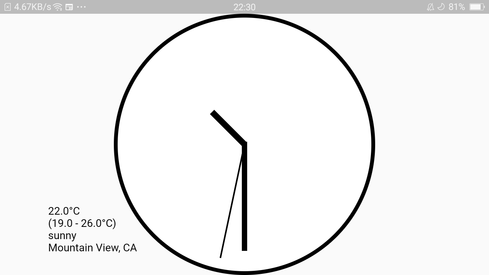
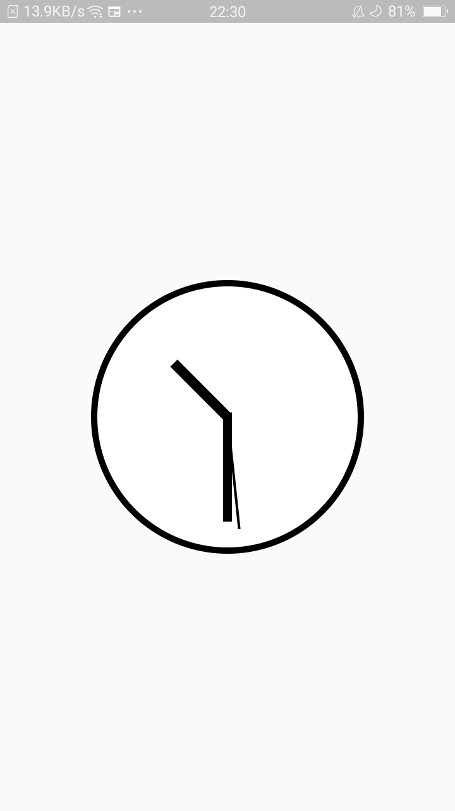

# Analog Clock

This app is an modified version of an analog clock from Flutter clock https://flutter.dev/clock customized by by Adhika Gunadarma.

Need to be intregated with flutter_clock_helper module from https://github.com/flutter/flutter_clock

